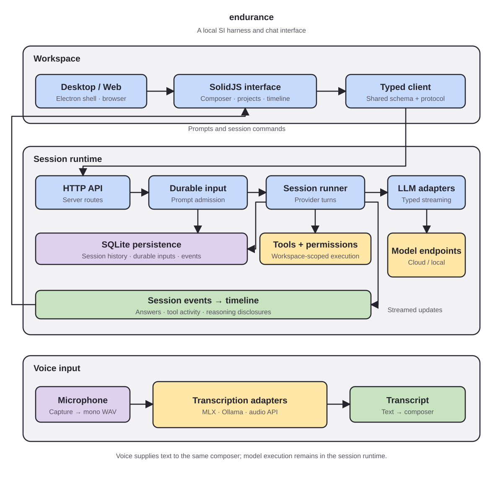

<p align="center">
  
</p>

<h1 align="center">ENDURANCE</h1>
<p align="center">A private SI platform for local and hosted models.</p>

<p align="center">
  &nbsp;
  &nbsp;
  &nbsp;
  &nbsp;
  &nbsp;
  &nbsp;
  &nbsp;
  &nbsp;
</p>

ENDURANCE is an SI platform you run on your own computers, from a laptop to a company's servers. Local models and hosted API models work side by side in the same workspace, and you decide per project which ones are allowed.

What you do with them stays yours. Conversations, requests, and results are recorded on your machines, so your usage history is something you keep and manage like the rest of your intellectual property, not something a provider holds for you.

You can also evaluate models on your own work: save tasks with reference material and review criteria, run them against any model, review the results yourself or with a second model, and compare runs.

## Features

- Local and hosted models in one workspace, with per-project limits on providers, provider addresses, and tool connections
- Project records of conversations, requests, and evaluations, with device-only and excluded files and optional request retention
- Model evaluations with saved cases, repeats, reviewer models or manual review, and run comparison
- Desktop (Electron) and web chat with project and session navigation
- Voice input through local MLX, Ollama (Qwen3-ASR), or any OpenAI-compatible transcription API
- Ollama model management: download, alias, set context, and register models for chat or voice
- Reasoning disclosures with elapsed-time labels

## Run from source

Requires Bun 1.3.14 (see `package.json`) and Node.js for Electron's install script.

```sh
git clone https://github.com/leejaywon/endurance.git
cd endurance
bun install
bun run dev:desktop
```

There is no tested installer or auto-update yet. See [docs/development.md](docs/development.md) for the web app, backend, and validation commands, and [docs/voice.md](docs/voice.md) for voice setup.

## Architecture

<p align="center">
  
</p>

| Layer | Packages |
| --- | --- |
| Workspace UI | [`desktop`](packages/desktop), [`app`](packages/app), [`session-ui`](packages/session-ui), [`ui`](packages/ui) |
| API and contracts | [`client`](packages/client), [`schema`](packages/schema), [`protocol`](packages/protocol), [`server`](packages/server) |
| Session core | [`core`](packages/core), [`llm`](packages/llm), [`opencode`](packages/opencode) |

## Privacy

The interface runs locally, but any cloud model or transcription provider you configure receives the content you send it.

## License

MIT. endurance derives from [OpenCode](https://github.com/anomalyco/opencode); its copyright and license are preserved in [LICENSE](LICENSE). See [asset credits](docs/assets/ATTRIBUTION.md).
